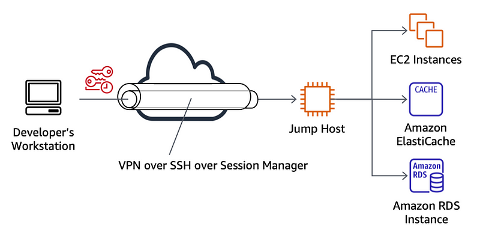

<p align="center">
  
  <h2 align="center">⚡ SSM Supercharged</h2>
  <p align="center">AWS SSM integration with OpenSSH + EC2 Instance Connect + sshuttle<p>
  <p align="center"><em>This repository is linked to the research conducted in this <a href="https://halim.qarroum.com/ssm-sessions-manager-on-steroids-83e01d5f11f4">Medium article</a>.</em></p>
  <p align="center">
    <a href="https://deepsource.io/gh/HQarroum/ssm-supercharged/?ref=repository-badge}" target="_blank"></a>
    <a href="https://www.codefactor.io/repository/github/hqarroum/ssm-supercharged"></a>
  </p>
</p>
<br>

Current version: **1.0.0**

Lead Maintainer: [Halim Qarroum](mailto:hqm.post@gmail.com)

## 📋 Table of content

- [Description](#-description)
- [Pre-Requisites](#-pre-requisites)
- [Installation](#-installation)
- [Usage](#-usage)
- [See also](#-see-also)

## 🔰 Description

This repository features a configuration file and a Bash script I use to streamline the AWS SSM Sessions Manager developer experience. It provides an example to achieve the following :

- Keep EC2 instances private and secure with empty inbound security groups, and no associated SSH key-pair.
- Run SSH through an SSM tunnel.
- Address EC2 instances using their instance identifiers, friendly name, public DNS name or private DNS name.
- Generate just-in-time temporary SSH certificates for connecting to certificate-less instances using [EC2 Instance Connect](https://docs.aws.amazon.com/AWSEC2/latest/UserGuide/Connect-using-EC2-Instance-Connect.html).
- Integrate [sshuttle](https://github.com/sshuttle/sshuttle) with SSM to establish a lightweight and free VPN to a remote VPC.

## 🎒 Pre-Requisites

Ensure you have the following tools available on your system before continuing.

- The OpenSSH client tools (ssh, ssh-agent, ssh-keygen, etc.)
- The [AWS CLI](https://docs.aws.amazon.com/cli/latest/userguide/getting-started-install.html)
- The [Sessions Manager Plugin](https://docs.aws.amazon.com/systems-manager/latest/userguide/session-manager-working-with-install-plugin.html) for the AWS CLI
- [sshuttle](https://github.com/sshuttle/sshuttle)

## 🚀 Installation

> This setup has been tested on Debian and MacOS.

### Install Keychain

[Keychain](https://www.funtoo.org/Funtoo:Keychain) is an awesome tool providing a front-end to `ssh-agent` and `ssh-add`. It allows to keep an `ssh-agent` instance per system, instead of a new instance for each terminal session.

> While Keychain is not a pre-requisite in itself, but rather a good practice I do use to streamline my workflow in having a single ssh-agent up and running at all times, you must ensure you have an ssh-agent running if you choose not to use Keychain.

You can install keychain via `apt` on Debian or `brew` on MacOS. Once it is installed, you can add the following line to your shell configuration (`.bashrc`, `.zshrc`, etc.) to automatically start `ssh-agent` only once per system, thus avoiding `ssh-agent` to prompt for SSH certificate passwords for each new terminal session.

```bash
eval `keychain --eval --agents ssh`
```

### OpenSSH Configuration

Next, you will need to update your `~/.ssh/config` file with the content of the [OpenSSH configuration file](./src/ssh_config) provided in this repository.

In a nutshell, this configuration tells OpenSSH that for any hostname matching an EC2 instance identifier, public DNS name, private DNS name or friendly-name, it must forward its traffic through an SSM tunnel, instead of establishing a direct connection to the instance.

Here is the part you need to add to your OpenSSH configuration file.

```bash
Host i-* mi-* aws-* ec2-*.compute.amazonaws.com ip-*.compute.internal
  ProxyCommand ~/.ssh/initiate-ssm-connection.sh %h %r %p
```

Finally, copy the [`initiate-ssm-connection.sh`](./src/initiate-ssm-connection.sh) file to your `~/.ssh/` directory. This is the proxy command that will be spawned by OpenSSH when establishing a connection to an EC2 instance.

## 🚌 Usage

> Ensure you have valid AWS credentials on your development machine before continuing. Also, I recomment you test with a small EC2 instance (e.g t2.micro) launched in a private VPC without any SSH key-pair attached for testing.

### OpenSSH

We are first going to ensure that an SSH connection can be successfullly tunneled to your instance. To do so, simply enter the following command with the identifier of your instance.

```bash
ssh user@i-example
```

You can also reference your EC2 instance through other attributes.

```bash
# Connecting using private DNS name.
ssh user@ip-172-31-1-2.us-east-1.compute.internal

# Connecting using friendly-name.
ssh user@aws-awesome-instance
```

### sshuttle

> [sshuttle](https://github.com/sshuttle/sshuttle) is a Transparent proxy server that works as a poor man's VPN. It works by establishing an SSH connection to a remote host and routes the traffic from a local machine targeting a specific IP CIDR to a remote network such as, in our case, an AWS VPC.

To establish a sshuttle connection, you can simply reference your instance like in the previous example, as sshuttle is going to make use of your OpenSSH configuration automatically.

For example, the below example will establish a VPN-like connection between your development machine and your remote VPC - in this example, I use a VPC CIDR of `172.31.0.0/16` for the remote VPC.

```bash
sshuttle --dns -r user@i-example 172.31.0.0/16
```

This will cause sshuttle to tunnel all traffic targeting `172.31.0.0/16` through an SSH-over-SSM tunnel using your EC2 instance as a jump host.

<br />
<p align="center">
  
</p>
<br />

## 👀 See Also

- How to install the [SSM Sessions Manager Plugin](https://docs.aws.amazon.com/systems-manager/latest/userguide/session-manager-working-with-install-plugin.html). 
- The [EC2 Instance Connect](https://docs.aws.amazon.com/AWSEC2/latest/UserGuide/Connect-using-EC2-Instance-Connect.html) documentation.
- The [sshuttle documentation](https://github.com/sshuttle/sshuttle).
